# TaskNexus - Task Manager React Native App 📱

**Time to get organized!** TaskNexus is a modern, cross-platform task management app built with React Native, Expo, and TypeScript. It allows users to efficiently manage their daily tasks with features like task addition, completion, deletion, drag-and-drop reordering, and interactive statistics visualization.

<p align="center">
  <!-- Core -->
  
  
  
  
  
  
  
  

  <!-- UI & Charts -->
  
  

  <!-- Backend & Data -->
  
  

  <!-- DevOps -->
  
  
  
  
  

  <!-- Testing -->
  
  

  <!-- Backup Optional Backend -->
  

  <!-- Code Quality & Misc -->
  
  
  
</p>

<p align="center">
  
</p>

## Table of Contents

- [Overview](#overview)
  - [TaskNexus Branding](#tasknexus-branding)
  - [iOS](#ios)
  - [Android](#android)
  - [Web](#web)
  - [Screen Recordings (GIFs)](#screen-recordings-gifs)
- [Features](#features)
- [Technical Stack & Libraries](#technical-stack--libraries)
  - [Core Dependencies](#core-dependencies)
  - [Backend & Data](#backend--data)
  - [Third-Party Dependencies](#third-party-dependencies)
  - [Other](#other)
- [Installation & Setup](#installation--setup)
  - [Prerequisites](#prerequisites)
  - [Clone the Repository](#clone-the-repository)
  - [Install Dependencies](#install-dependencies)
  - [Running the App](#running-the-app)
- [Usage Instructions](#usage-instructions)
- [File Structure](#file-structure)
- [Supabase Database Schema](#supabase-database-schema)
- [Scripts & Tools](#scripts--tools)
- [Testing](#testing)
  - [Running Tests](#running-tests)
  - [Test Coverage](#test-coverage)
  - [Watch Mode](#watch-mode)
- [Known Issue](#known-issue)
- [License](#license)
- [Contact](#contact)

## Overview

**TaskNexus - Task Manager React Native App** is a modern, cross-platform mobile application built using React Native with Expo and TypeScript.

The app allows users to manage their daily tasks efficiently, with features like task addition, completion, deletion, and drag-and-drop reordering.

The app also includes a dedicated Stats screen with interactive charts (pie, bar, and line) for visualizing task statistics.
It also features dark/light theme toggling with smooth transitions and a custom bottom tab bar for a better UI/UX.

<p align="center">
  
</p>

### TaskNexus Branding

I chose the name "TaskNexus" for the app to reflect its core purpose - a central hub for managing tasks.

I hope its name and branding convey a sense of connectivity and organization, with the app serving as a nexus for all tasks and to-dos.

### iOS

<p align="center">
  
  
  
  
  
  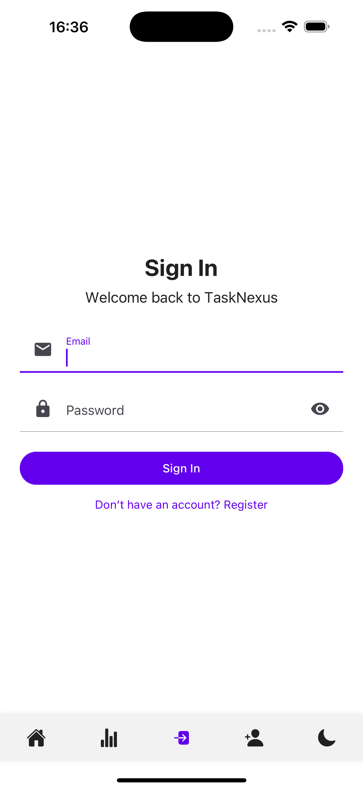
  
  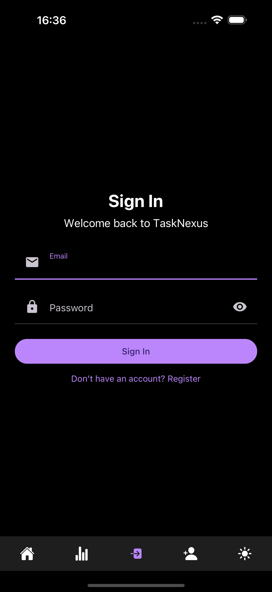
  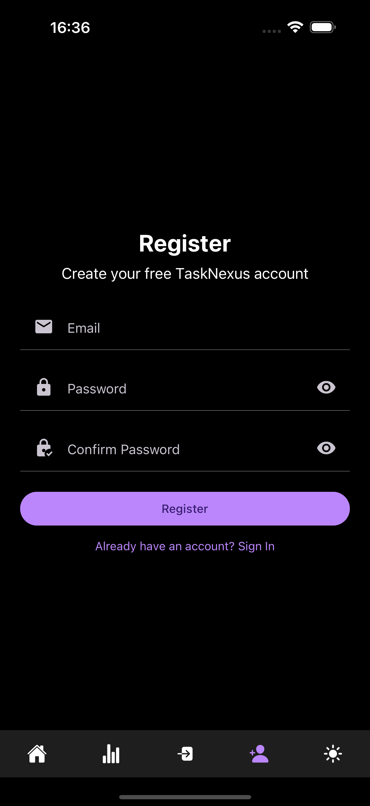
</p>

### Android

<p align="center">
  
  
  
  
  
  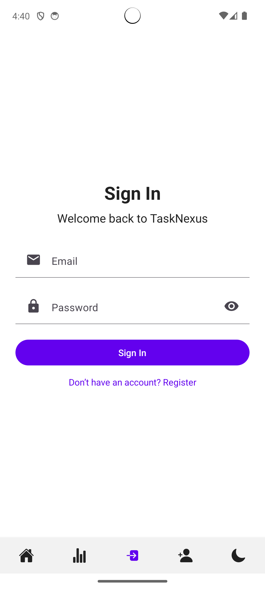
  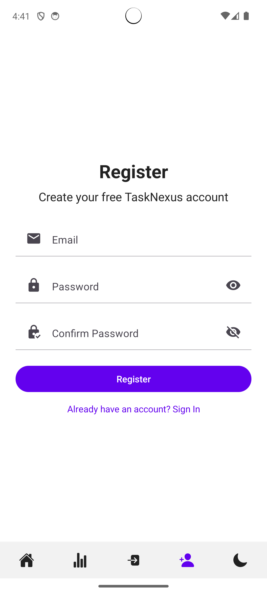
  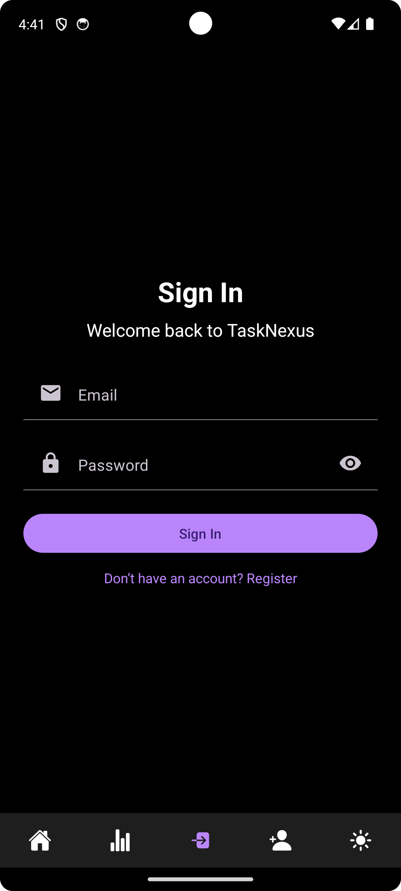
  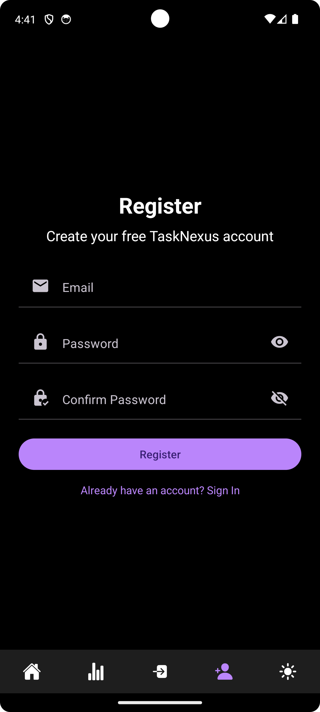
</p>

### Modals

<p align="center">
  
  
  
  
</p>

### Web

<p align="center">
  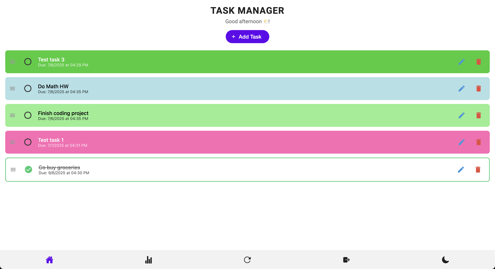
  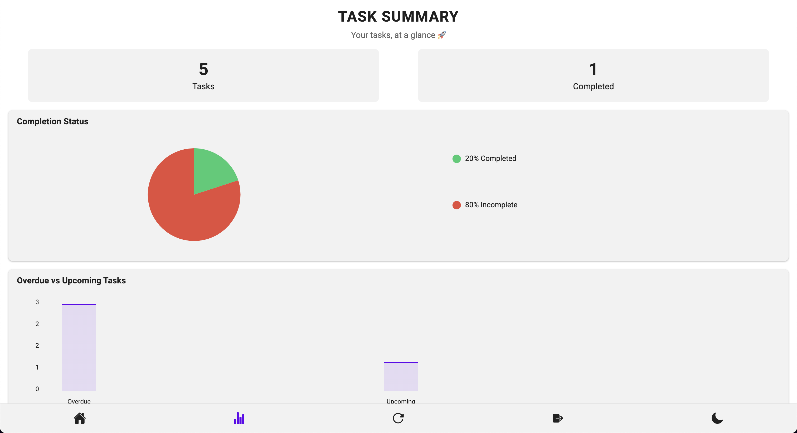
  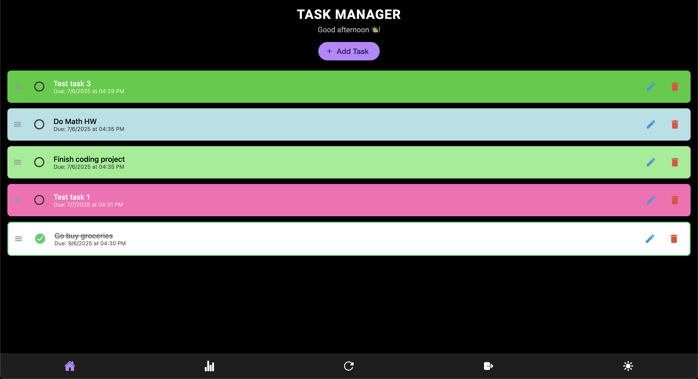
  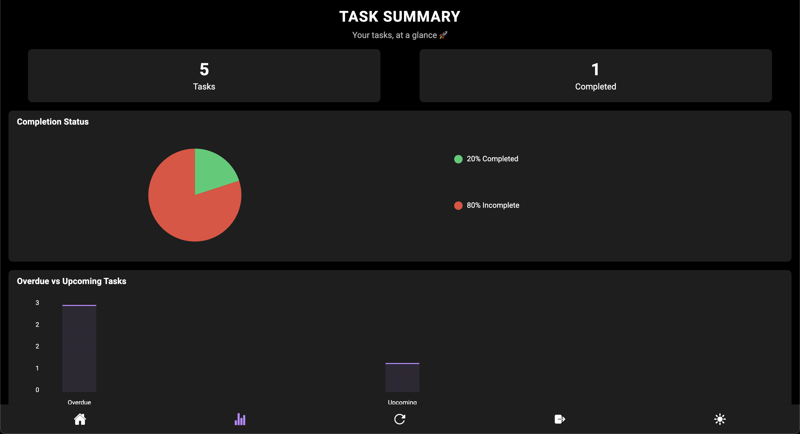
  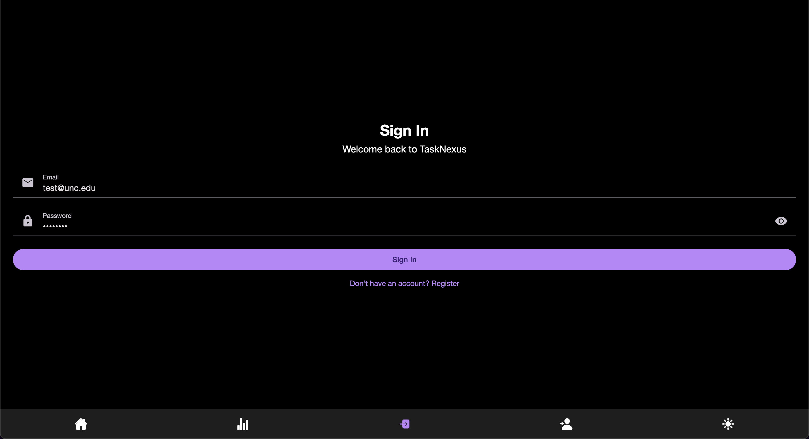
  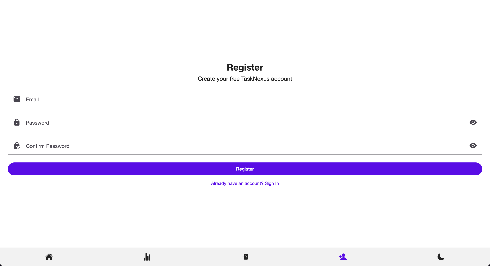
</p>

### Screen Recordings (GIFs)

<p align="center">
  
  
</p>

### Realtime Synchronization Demo

<p align="center">
  
</p>

> [!IMPORTANT]
> The above GIFs and images may not fully represent the app's current state, as they were recorded during development. The app has since been updated with new features and improvements. Please clone the repository and run the app to see the latest version in action!

## Features

### Task Management

- **Add, Update & Delete Tasks:** Easily manage your daily tasks through an interactive interface.
- **Drag-and-Drop Reordering:** Rearrange tasks using a smooth, touch-friendly drag-and-drop mechanism.
- **Global State Management:** Uses React Context to manage task state across the app for consistent data handling.
- **Task Completion Toggle:** Mark tasks as complete or incomplete with a simple checkbox interaction.
- **Task Deletion:** Remove tasks with a dedicated delete action, ensuring a clean task list.

### Cloud Synchronization

- **Supabase Integration:** Utilizes Supabase for real-time data synchronization, ensuring tasks are always up-to-date across devices.
- **User Authentication:** Supports user authentication with Supabase, allowing users to securely manage their tasks.
- **Automatic Realtime Synchronization:** Changes made to tasks are instantly reflected across all devices, providing a seamless user experience.
- **PostgreSQL Database:** Stores tasks in a PostgreSQL database, providing robust data management and querying capabilities.
- **Backup Option:** Includes a Ruby on Rails backend as an optional backup for task management, ensuring data persistence and reliability.
- **Manual Refresh:** Users can manually refresh the task list if they wish to ensure they have the latest data from the server.

### Statistics Visualization

- **Pie Chart:** Visualizes the ratio of completed vs. incomplete tasks.
- **Bar Chart:** Compares overdue and upcoming tasks with wider, closely spaced bars.
- **Line Chart:** Plots tasks over time (by month), ensuring continuity even if only a single month is available.
- **Transparent & Themed Charts:** All charts feature transparent backgrounds and adjust seamlessly to the current theme.
- **Immediate Data Updates:** Charts update in real-time as tasks are added, completed, or deleted.

### Theme & UI

- **Dark/Light Mode Toggle:** Switch between dark and light themes with a toggle integrated into the custom bottom tab bar.
  - Automatically detects the system theme (light/dark) and adjusts the app theme accordingly on startup.
- **Smooth Transitions:** Animated transitions (200ms) for background and UI elements when changing themes.
- **Consistent Material Design:** Built with React Native Paper, ensuring a uniform look and feel across all screens.

### Navigation & Routing

- **Expo Router:** Utilizes Expo Router for clean, declarative navigation between screens.
- **Automatic Root Redirection:** Redirects the root route ("/") to the home screen, ensuring a smooth entry.
- **Fallback Screen:** Provides a custom +not-found screen for undefined routes.

### Flash Screen

- **Splash Screen:** Custom splash screen with app name and slogan.
- **Redirection:** Automatically redirects to the home screen after the splash screen (3 seconds).

## Technical Stack & Libraries

TaskNexus is built using a modern tech stack that includes both core and third-party libraries to enhance functionality and user experience. Here are the key components:

### **Core Dependencies:**

- **React Native:** Core framework for building cross-platform mobile applications.
- **TypeScript:** Enhances code quality with static type checking.
- **React Context API:** Manages global state for tasks and theme overrides.
- **React Navigation / Expo Router:** Manages navigation and deep linking.
- **React Native Gesture Handler:** Enables smooth gesture handling for drag-and-drop functionality.
- **React Native Reanimated:** Powers animations and transitions for a fluid user experience.
- **React Native Safe Area:** Ensures proper layout and spacing on devices with notches or rounded corners.

### **Backend & Data:**

- **Supabase:** Provides real-time database, authentication, and storage services.
- **PostgreSQL:** The underlying database for storing tasks and user data.
- **Ruby on Rails (Optional):** A backup backend for task management, providing an alternative data persistence layer.
- **Docker:** Containerization for the Ruby backend, allowing easy deployment and management.
- **AWS:** Used for hosting the Ruby backend and managing cloud resources.

### **Third-Party Dependencies:**

- **Expo:** Provides a robust development workflow and build process.
- **Expo Font:** Simplifies font loading and management (custom Google fonts included).
- **Expo Status Bar:** Customizes the status bar for better aesthetics and user experience.
- **React Native Paper:** Offers Material Design components and theming.
- **React Native Vector Icons:** Provides customizable icons for a polished UI.
- **React Native Chart Kit:** Renders customizable charts (pie, bar, line).
- **React Native Draggable FlatList:** Enables drag-and-drop reordering of tasks.
- **React Native DateTime Picker:** Provides a user-friendly date and time selection interface.
- **Prettier:** Maintains code quality and consistent formatting.
- **Docker:** Containerizes the React Native app for easier deployment and testing.

### **Other:**

- **Jest & React Testing Library:** For unit and integration testing of components and functionality.
- **JSDoc & TypeScript Definitions:** Documented code for better understanding and type safety.
- **Google Fonts:** Includes custom Google fonts (Roboto) and images for branding.
- **Shell Scripts:** Simplify common tasks with custom shell scripts.
- **GitHub Actions:** CI/CD pipeline for automated testing and deployment.

## Installation & Setup

### Prerequisites

- **Node.js:** Version 14 or above.
- **Yarn** or **npm:** For package management.
- **Expo CLI:** Install globally (if not already present)
  ```bash
  npm install -g expo-cli
  ```
- **Android/iOS Emulator or Physical Device:** For testing on mobile platforms.
  - This is required for testing the app on Android/iOS devices. Alternatively, you can use the web version for a quick preview.
- **Supabase Account:** For cloud synchronization and user authentication.
  - Sign up for a free account at [Supabase](https://supabase.io/) and create a new project.
  - Set up the PostgreSQL database and configure the necessary tables for tasks.
  - Create a `.env` file in the root directory of the project with your Supabase credentials:
    ```
    EXPO_PUBLIC_SUPABASE_URL=your_supabase_url
    EXPO_PUBLIC_SUPABASE_ANON_KEY=your_supabase_anon_key
    ```
- **Docker (Optional):** For containerization and running the app in a Docker environment.
  - If you want to run the app in a Docker container, ensure that Docker is installed and running on your system.

### Clone the Repository

```bash
git clone https://github.com/hoangsonww/Task-Manager-ReactNative.git
cd Task-Manager-ReactNative
```

### Install Dependencies

Using npm:

```bash
npm install
```

Using Yarn:

```bash
yarn install
```

### Running the App

Start the Expo development server:

```bash
npm start
# or
yarn start
```

Alternatively, you can use the Expo CLI directly:

```bash
npx expo start
```

> Note: You can also use the `-c` flag to clear the cache and start fresh if needed: `npx expo start -c`.

Then:

- Open the app on your device using the Expo Go app, or
- Use an Android/iOS simulator (remember to press `a` or `i` in the terminal to open the app on Android/iOS, respectively, with the simulator/emulator running), or
- Open the project in a web browser for a quick preview (remember to press `w` in the terminal, it will then open a new tab in your default browser).
  > Note: The web version may not display correctly on larger screens. Also, some functionalities, like drag-and-drop, date picker, time picker, etc. may not work as expected on the web since they are designed for mobile devices.
- Enjoy managing your tasks with TaskNexus! 🚀

## Usage Instructions

Once the app is running, you can start using TaskNexus to manage your tasks. Here are some key features and how to use them:

### Authentication

- **Register:** Create a new account by navigating to the Register screen and filling out the form.
- **Login:** Log in to your existing account by navigating to the Login screen and entering your credentials.
- **Logout:** You can log out from the home screen by tapping the logout button in the custom bottom tab bar.

> [!NOTE]
> You will be required to log in or register before you can access the home screen and manage tasks. This is to ensure that your tasks are securely stored in the cloud and can be accessed from any device.

### Home Screen

- **Add Tasks:** Tap the "Add Task" button to open a modal where you can enter new tasks.
- **Reorder Tasks:** Drag and drop tasks to adjust their order.
- **Toggle Completion:** Tap the checkbox on a task to mark it as complete or incomplete.
- **Delete Tasks:** Remove tasks with the delete action.

### Stats Screen

- **View Charts:**
  - **Pie Chart:** Displays the proportion of completed vs. incomplete tasks.
  - **Bar Chart:** Compares overdue vs. upcoming tasks with wide, closely spaced bars.
  - **Line Chart:** Plots tasks over time by month, ensuring continuity even if only one month is present.
- **Theme Adaptation:**  
  Charts are fully transparent and adapt to the current dark/light theme.

### Theme Toggle

- **Switch Themes:** Use the toggle in the custom bottom tab bar to switch between dark and light modes. The transition is animated over 200ms for a smooth experience.

### Routing

- **Automatic Redirection:** The root route ("/") automatically redirects to the home screen.
- **Fallback:** Invalid routes are handled by the `+not-found` screen (though no such routes are present in the app - it's _technically_ impossible to get lost!).

_... and so much more! set up the app locally and explore its features!_

## File Structure

```
Task-Manager-ReactNative
├── app.json                       # Expo configuration file
├── package.json                   # Project dependencies and scripts
├── tsconfig.json                  # TypeScript configuration file
├── .gitignore                     # Git ignore file
├── Dockerfile                     # Dockerfile for containerization
├── docker-compose.yml             # Docker Compose file for containerization
├── jest.config.js                 # Jest configuration for testing
├── babel.config.js                # Babel configuration for transpiling code
├── jest.setup.js                  # Jest setup file for testing
├── .env                           # Environment variables for Supabase credentials
├── .github
│   └── workflows
│       └── ci.yml                 # GitHub Actions CI/CD workflow configuration
├── app
│   ├── _layout.tsx                # Main layout with theme, navigation, and context providers
│   ├── index.tsx                  # Flash screen and redirection to home screen
│   ├── +not-found.tsx             # Custom Not Found screen for undefined routes
│   └── (tabs)
│       ├── _layout.tsx            # Layout for tabbed screens
│       ├── register.tsx           # Registration screen for user authentication
│       ├── login.tsx              # Login screen for user authentication
│       ├── home.tsx               # Home screen for task management
│       └── stats.tsx              # Stats screen for displaying charts and statistics
├── components
│   ├── Chart.tsx                  # Reusable chart component for pie, bar, and line charts
│   ├── CustomTabBar.tsx           # Custom bottom tab bar component (with theme toggle)
│   ├── TaskAddModal.tsx           # Modal component for adding new tasks
│   └── TaskItem.tsx               # Component for displaying individual tasks
├── constants
│   └── Colors.ts                  # Color definitions for light and dark themes
├── contexts
│   ├── ThemeOverrideContext.tsx   # React Context for theme override management (dark/light mode)
│   └── TaskContext.tsx            # React Context for global task state management
├── hooks
│   └── usePrevious.ts             # Custom hook to capture previous state values
├── lib
│   └── supabaseClient.ts          # Supabase client configuration for database interactions
├── scripts
│   └── reset-project.js           # Script to reset project state (if needed)
├── styles
│   ├── HomeScreenStyles.ts        # Custom styles for the Home screen
│   ├── StatsScreenStyles.ts       # Custom styles for the Stats screen
│   ├── IndexStyles.ts             # Custom styles for the Flash screen and redirection
│   ├── LayoutStyles.ts            # Custom styles for the main layout
│   ├── TaskModalStyles.ts         # Custom styles for the task add modal
│   ├── TaskItemStyles.ts          # Custom styles for individual task items
│   ├── NotFoundStyles.ts          # Custom styles for the Not Found screen
│   └── CustomTabStyles.ts         # Custom styles for the tab bar and related UI components
├── ruby                           # Ruby backend for backup task management (optional)
│   ├── Gemfile                    # Ruby dependencies for the backup Rails backend
│   ├── app.rb                     # Main Ruby API application file
│   ├── config.ru                  # Rack configuration file for the Ruby app
│   ├── app/                       # Ruby app directory
│   │   ├── controllers/           # Ruby app controllers directory
│   │   ├── models/                # Ruby app models directory
│   ├── config/                    # Ruby app configuration directory
│   ├── initializers/              # Ruby app initializers directory
├── types
│   └── types.ts                   # TypeScript type definitions for the project
├── assets
│   ├── fonts                      # Custom fonts for the app (Roboto)
│   └── images                     # Images used in the app
├── aws                            # AWS configuration files
│   ├── main.tf                    # Terraform configuration for AWS resources
│   ├── variables.tf               # Variables for AWS configuration
│   ├── outputs.tf                 # Outputs for AWS configuration
│   └── lambda
│       └── handler.js             # Lambda function handler for AWS
├── __tests__                      # Test files for the project
├── __mocks__                      # Mock files for testing
├── img                            # Screenshots and GIFs for the README
└── shell                          # Shell scripts for common tasks
    ├── run-platform.sh            # Script to run the app on a specific platform
    ├── format.sh                  # Script to format the project code
    ├── start.sh                   # Script to start the app
    ├── reset.sh                   # Script to reset the project state
    └── update.sh                  # Script to update project dependencies

(...and more files not listed here...)
```

## Supabase Database Schema

The Supabase database schema for TaskNexus includes the following tables:

### `tasks` Table

| Column Name   | Data Type    | Description                                  |
|---------------|--------------|----------------------------------------------|
| `id`          | UUID         | Unique identifier for the task (primary key)|
| `text`        | Text         | The text content of the task                 |
| `color`       | Text         | Color associated with the task (optional)    |
| `due_date`    | Timestamp    | Due date and time for the task (optional)    |
| `completed`   | Boolean      | Indicates if the task is completed (default: false) |
| `inserted_at` | Timestamp    | Timestamp when the task was created (default: current timestamp) |
| `updated_at`  | Timestamp    | Timestamp when the task was last updated (default: current timestamp) |
| `user_id`     | UUID         | Foreign key referencing the user who created the task |

### `users` Table

| Column Name   | Data Type    | Description                                  |
|---------------|--------------|----------------------------------------------|
| `id`          | UUID         | Unique identifier for the user (primary key)|
| `email`       | Text         | Email address of the user (unique)          |
| `password`    | Text         | Password hash for user authentication        |
| `created_at`  | Timestamp    | Timestamp when the user was created (default: current timestamp) |
| `updated_at`  | Timestamp    | Timestamp when the user was last updated (default: current timestamp) |

<p align="center">
  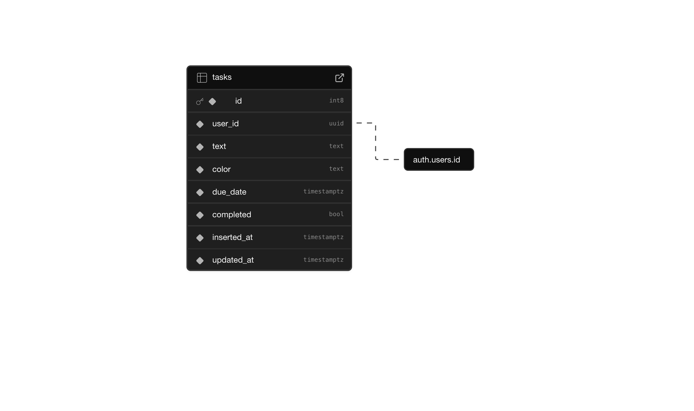
</p>

## Scripts & Tools

- **reset-project.js:** Located in the `scripts` folder, this script resets the project state as needed.
- **Prettier:** Integrated to maintain code quality and consistent formatting.
  - Use by simply running `npm run format` or `yarn format` to format the entire project. It formats most (if not all) files in the project according to the Prettier configuration.
- **Documented Code:** Includes JSDoc comments for functions and TypeScript type definitions for better code understanding.
- **Shell Scripts**: Several shell scripts are included to simplify common tasks, such as starting the app, resetting the project, and updating dependencies. Feel free to use them for easier project management!
  - Use the script by first running `chmod +x <script-name>.sh` to make it executable, then run `./<script-name>.sh` to execute it.
- **Dockerfile (Optional)**: A Dockerfile is provided to containerize the app if needed. However, since mobile testing requires physical devices or emulators, the Dockerfile is designed only for the web version of the app.
  - Use the Docker Compose file (`docker-compose.yml`) to build and run the Docker container, by running `docker-compose up --build`. Ensure that Docker is installed and running on your system.
- **Makefile (Optional)**: A Makefile is included to simplify common tasks. You can use it to run commands like `make start`, `make format`, `make test`, etc. This is optional and not required for the app to function, but it can be useful for quick access to common commands.
- **GitHub Actions:** A CI/CD pipeline is set up to run tests and ensure code quality on every push or pull request. This helps maintain the integrity of the codebase and ensures that new changes do not break existing functionality.

## Testing

TaskNexus includes unit and integration tests to ensure the app's functionality and reliability. The tests are written using Jest and React Testing Library.

### Running Tests

To run the tests, use the following command:

```bash
npm test
# or
yarn test
```

This will execute all tests in the `__tests__` directory and output the results in the terminal.

### Test Coverage

To check the test coverage, use the following command:

```bash
npm run test:coverage
# or
yarn test:coverage
```

This will generate a coverage report in the `coverage` directory, showing which parts of the code are covered by tests.

### Watch Mode

To run tests in watch mode, which automatically re-runs tests when files change, use the following command:

```bash
npm run test:watch
# or
yarn test:watch
```

This is useful during development to quickly see the results of changes without having to manually re-run tests.

## Known Issue

- The **React Native Draggable FlatList** library has a known issue dragging and dropping an item causes it to quickly flash back to its original position before settling in the new position. This is a minor visual glitch and does not affect functionality.
  - This issue is widely reported in both StackOverflow and GitHub discussions, and it seems to be a limitation of the library itself. I have tried several workarounds, but none have resolved the issue completely.
  - If I have some more free time, I would explore alternative libraries or custom implementations to achieve a smoother drag-and-drop experience.
  - For now, the app remains fully functional, and users can still drag and drop tasks without any issues.
  - The app is designed to be user-friendly, and this minor visual glitch does not hinder the overall experience.

## License

This project is licensed under the MIT License. See the [LICENSE](LICENSE) file for more details.

> [!CAUTION]
> This project is for educational purposes only and is not intended for production use. It is a personal project to demonstrate my skills in React Native, Expo, and TypeScript. Please be sure to credit the original author if you use any part of this code in your own projects, regardless of use case.

## Contact

For any questions, feedback, or suggestions, please contact:

- **Name:** [Son Nguyen](https://sonnguyenhoang.com)
- **Email:** [hoangson091104@gmail.com](mailto:hoangson091104@gmail.com)
- **GitHub:** [@hoangsonww](https://github.com/hoangsonww)

---

**Thank you for checking out TaskNexus - Task Manager React Native App! 🚀📲**

**[🔝 Back to top](#tasknexus---task-manager-react-native-app-)**
