# TaskNexus - Task Manager React Native App 📱

[](package.json)
[](https://reactnative.dev/)
[](https://expo.dev/)
[](https://nodejs.org/)
[](https://www.typescriptlang.org/)
[](https://www.npmjs.com/)
[](https://yarnpkg.com/)
[](https://prettier.io/)
[](https://callstack.github.io/react-native-paper/)
[](https://www.npmjs.com/package/react-native-chart-kit)
[](LICENSE)

<p align="center">
  
</p>

## Table of Contents

- [Overview](#overview)
  - [TaskNexus Branding](#tasknexus-branding)
  - [iOS](#ios)
  - [Android](#android)
  - [Web](#web)
  - [Screen Recordings (GIFs)](#screen-recordings-gifs)
- [Features](#features)
- [Technical Stack & Libraries](#technical-stack--libraries)
  - [Core Dependencies](#core-dependencies)
  - [Third-Party Dependencies](#third-party-dependencies)
- [Installation & Setup](#installation--setup)
  - [Prerequisites](#prerequisites)
  - [Clone the Repository](#clone-the-repository)
  - [Install Dependencies](#install-dependencies)
  - [Running the App](#running-the-app)
- [Usage Instructions](#usage-instructions)
- [File Structure](#file-structure)
- [Scripts & Tools](#scripts--tools)
- [Known Issue](#known-issue)
- [Future Enhancements](#future-enhancements)
- [License](#license)
- [Contact](#contact)

## Overview

**TaskNexus - Task Manager React Native App** is a modern, cross-platform mobile application built using React Native with Expo and TypeScript.

The app allows users to manage their daily tasks efficiently, with features like task addition, completion, deletion, and drag-and-drop reordering.

The app also includes a dedicated Stats screen with interactive charts (pie, bar, and line) for visualizing task statistics.
It also features dark/light theme toggling with smooth transitions and a custom bottom tab bar for a better UI/UX.

<p align="center">
  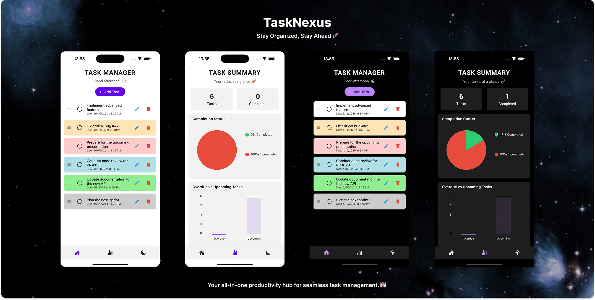
</p>

### TaskNexus Branding

I chose the name "TaskNexus" for the app to reflect its core purpose - a central hub for managing tasks.

I hope its name and branding convey a sense of connectivity and organization, with the app serving as a nexus for all tasks and to-dos.

### iOS

<p align="center">
  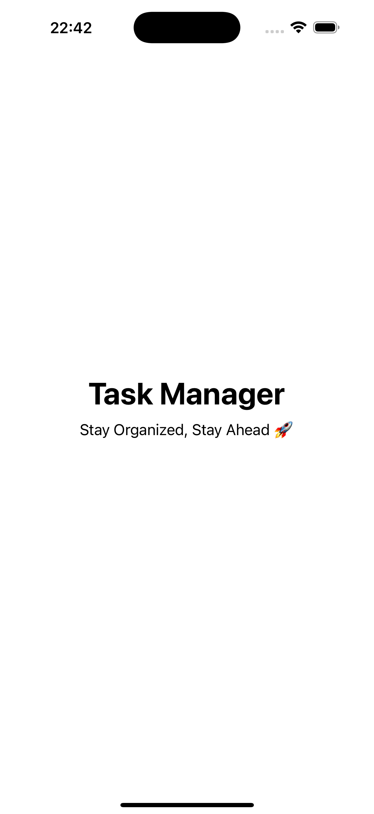
  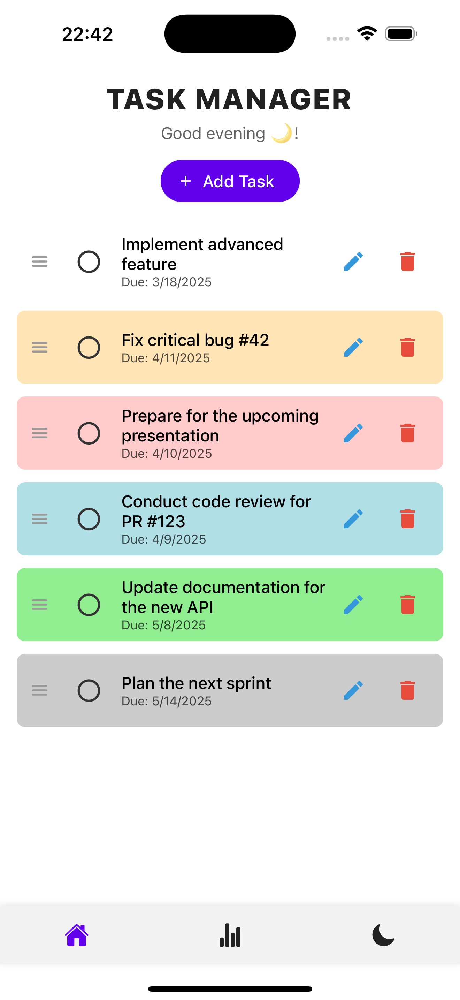
  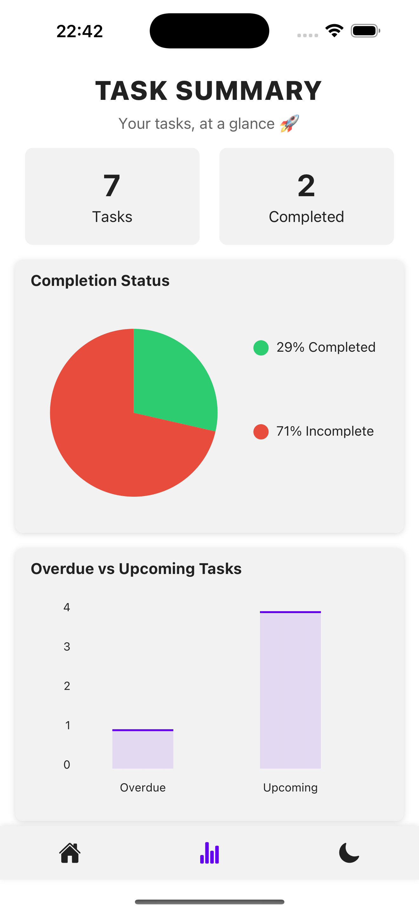
  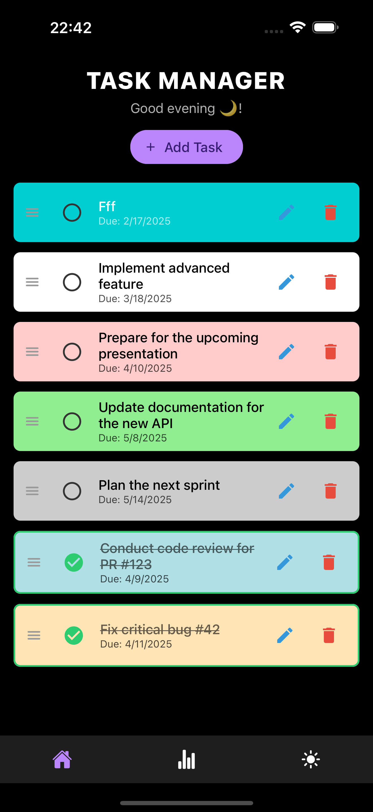
  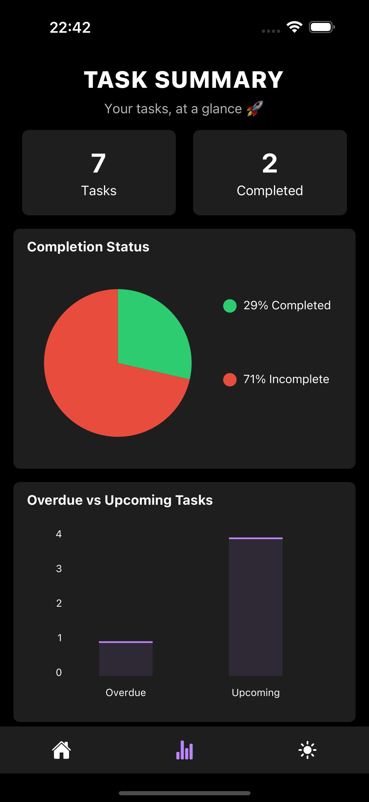
</p>

### Android

<p align="center">
  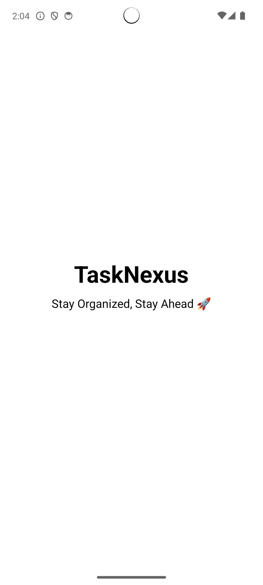
  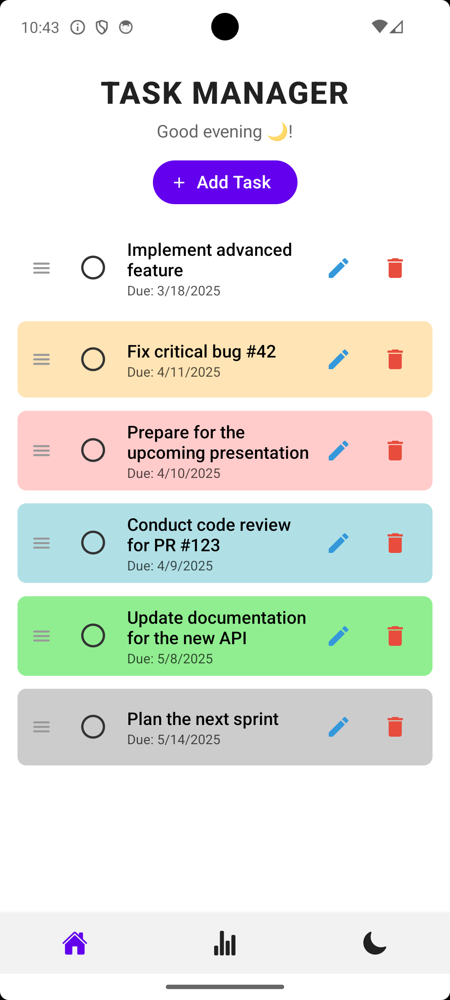
  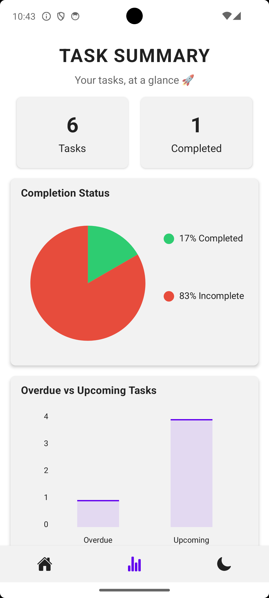
  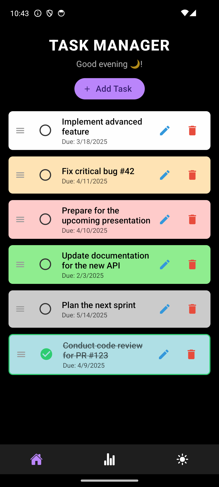
  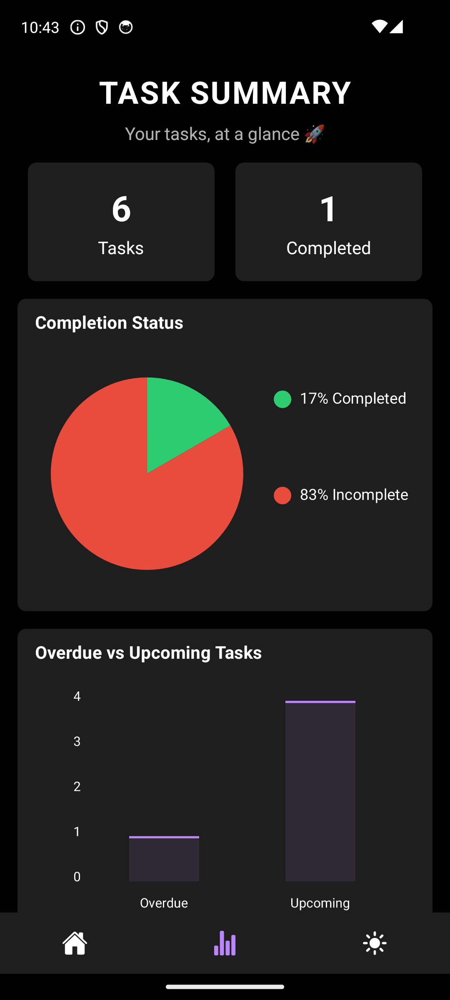
</p>

### Modals

<p align="center">
  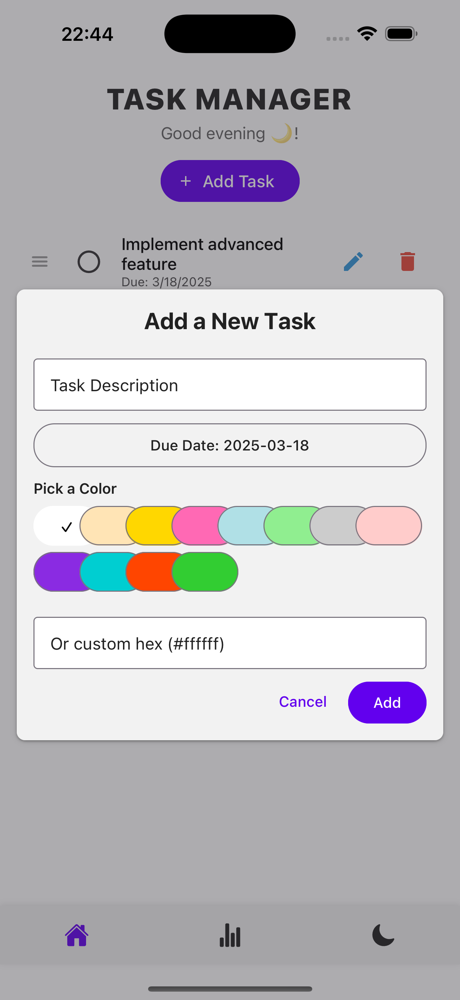
  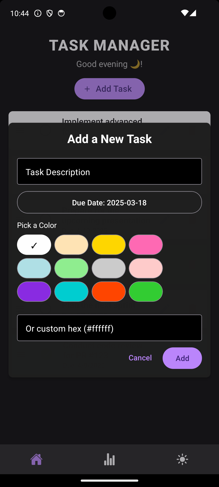
  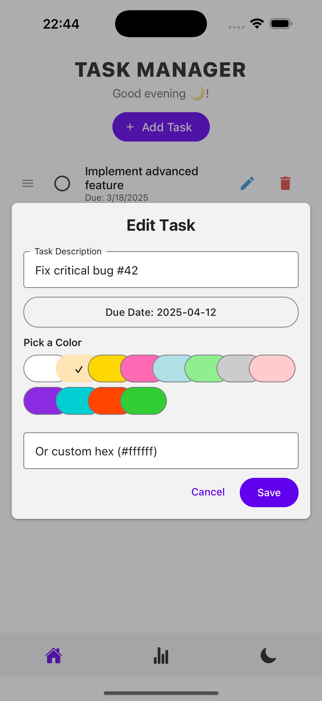
  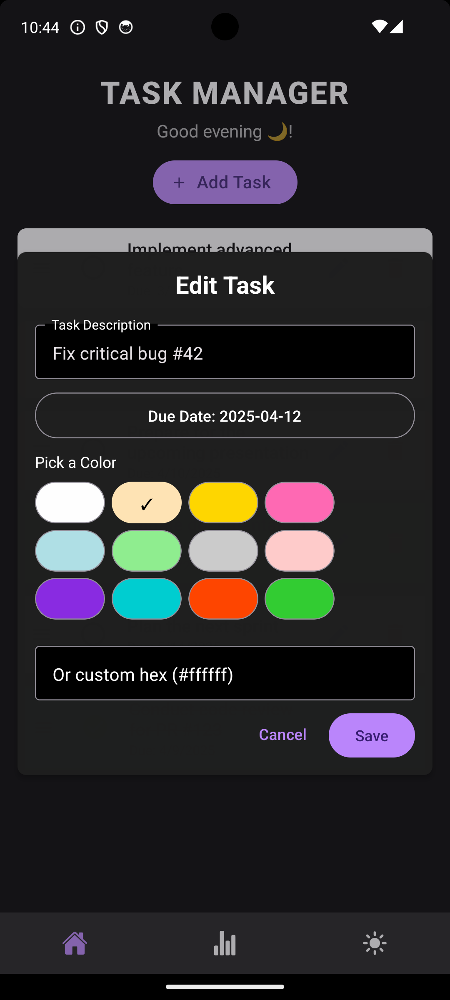
</p>

### Web

<p align="center">
  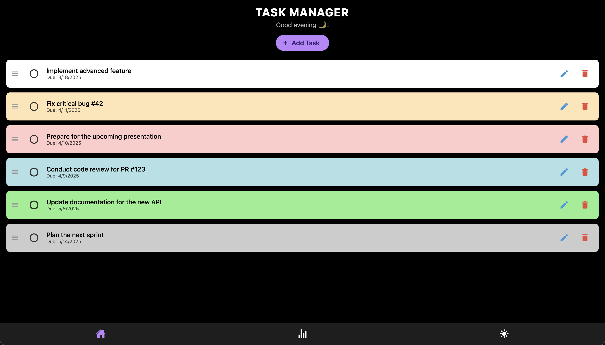
</p>

### Screen Recordings (GIFs)

<p align="center">
  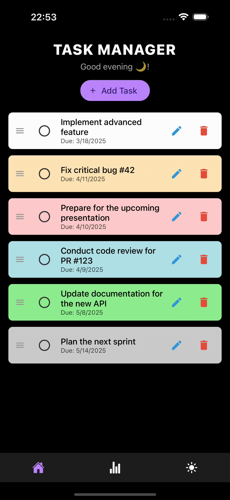
  
</p>

## Features

### Task Management

- **Add, Update & Delete Tasks:** Easily manage your daily tasks through an interactive interface.
- **Drag-and-Drop Reordering:** Rearrange tasks using a smooth, touch-friendly drag-and-drop mechanism.
- **Global State Management:** Uses React Context to manage task state across the app for consistent data handling.

### Statistics Visualization

- **Pie Chart:** Visualizes the ratio of completed vs. incomplete tasks.
- **Bar Chart:** Compares overdue and upcoming tasks with wider, closely spaced bars.
- **Line Chart:** Plots tasks over time (by month), ensuring continuity even if only a single month is available.
- **Transparent & Themed Charts:** All charts feature transparent backgrounds and adjust seamlessly to the current theme.

### Theme & UI

- **Dark/Light Mode Toggle:** Switch between dark and light themes with a toggle integrated into the custom bottom tab bar.
  - Automatically detects the system theme (light/dark) and adjusts the app theme accordingly on startup.
- **Smooth Transitions:** Animated transitions (200ms) for background and UI elements when changing themes.
- **Consistent Material Design:** Built with React Native Paper, ensuring a uniform look and feel across all screens.

### Navigation & Routing

- **Expo Router:** Utilizes Expo Router for clean, declarative navigation between screens.
- **Automatic Root Redirection:** Redirects the root route ("/") to the home screen, ensuring a smooth entry.
- **Fallback Screen:** Provides a custom +not-found screen for undefined routes.

### Flash Screen

- **Splash Screen:** Custom splash screen with app name and slogan.
- **Redirection:** Automatically redirects to the home screen after the splash screen (3 seconds).

## Technical Stack & Libraries

TaskNexus is built using a modern tech stack that includes both core and third-party libraries to enhance functionality and user experience. Here are the key components:

### **Core Dependencies:**

- **React Native:** Core framework for building cross-platform mobile applications.
- **TypeScript:** Enhances code quality with static type checking.
- **React Context API:** Manages global state for tasks and theme overrides.
- **React Navigation / Expo Router:** Manages navigation and deep linking.
- **React Native Gesture Handler:** Enables smooth gesture handling for drag-and-drop functionality.
- **React Native Reanimated:** Powers animations and transitions for a fluid user experience.
- **React Native Safe Area:** Ensures proper layout and spacing on devices with notches or rounded corners.

### **Third-Party Dependencies:**

- **Expo:** Provides a robust development workflow and build process.
- **Expo Font:** Simplifies font loading and management (custom Google fonts included).
- **Expo Status Bar:** Customizes the status bar for better aesthetics and user experience.
- **React Native Paper:** Offers Material Design components and theming.
- **React Native Vector Icons:** Provides customizable icons for a polished UI.
- **React Native Chart Kit:** Renders customizable charts (pie, bar, line).
- **React Native Draggable FlatList:** Enables drag-and-drop reordering of tasks.
- **React Native DateTime Picker:** Provides a user-friendly date and time selection interface.
- **Prettier:** Maintains code quality and consistent formatting.

### **Other:**

- **JSDoc & TypeScript Definitions:** Documented code for better understanding and type safety.
- **Google Fonts:** Includes custom Google fonts (Roboto) and images for branding.
- **Shell Scripts:** Simplify common tasks with custom shell scripts.

## Installation & Setup

### Prerequisites

- **Node.js:** Version 14 or above.
- **Yarn** or **npm:** For package management.
- **Expo CLI:** Install globally (if not already present)
  ```bash
  npm install -g expo-cli
  ```
- Android/iOS Emulator or Physical Device: For testing on mobile platforms.
  - This is required for testing the app on Android/iOS devices. Alternatively, you can use the web version for a quick preview.

### Clone the Repository

```bash
git clone https://github.com/hoangsonww/Task-Manager-ReactNative.git
cd Task-Manager-ReactNative
```

### Install Dependencies

Using npm:

```bash
npm install
```

Using Yarn:

```bash
yarn install
```

### Running the App

Start the Expo development server:

```bash
npm start
# or
yarn start
```

Alternatively, you can use the Expo CLI directly:

```bash
npx expo start
```

> Note: You can also use the `-c` flag to clear the cache and start fresh if needed: `npx expo start -c`.

Then:

- Open the app on your device using the Expo Go app, or
- Use an Android/iOS simulator (remember to press `a` or `i` in the terminal to open the app on Android/iOS, respectively, with the simulator/emulator running), or
- Open the project in a web browser for a quick preview (remember to press `w` in the terminal, it will then open a new tab in your default browser).
  > Note: The web version may not display correctly on larger screens. Also, some functionalities, like drag-and-drop, date picker, time picker, etc. may not work as expected on the web since they are designed for mobile devices.
- Enjoy managing your tasks with TaskNexus! 🚀

## Usage Instructions

### Home Screen

- **Add Tasks:** Tap the "Add Task" button to open a modal where you can enter new tasks.
- **Reorder Tasks:** Drag and drop tasks to adjust their order.
- **Toggle Completion:** Tap the checkbox on a task to mark it as complete or incomplete.
- **Delete Tasks:** Remove tasks with the delete action.

### Stats Screen

- **View Charts:**
  - **Pie Chart:** Displays the proportion of completed vs. incomplete tasks.
  - **Bar Chart:** Compares overdue vs. upcoming tasks with wide, closely spaced bars.
  - **Line Chart:** Plots tasks over time by month, ensuring continuity even if only one month is present.
- **Theme Adaptation:**  
  Charts are fully transparent and adapt to the current dark/light theme.

### Theme Toggle

- **Switch Themes:** Use the toggle in the custom bottom tab bar to switch between dark and light modes. The transition is animated over 200ms for a smooth experience.

### Routing

- **Automatic Redirection:** The root route ("/") automatically redirects to the home screen.
- **Fallback:** Invalid routes are handled by the `+not-found` screen (though no such routes are present in the app - it's _technically_ impossible to get lost!).

## File Structure

```
Task-Manager-ReactNative
├── app.json                       # Expo configuration file
├── package.json                   # Project dependencies and scripts
├── tsconfig.json                  # TypeScript configuration file
├── .gitignore                     # Git ignore file
├── Dockerfile                     # Dockerfile for containerization
├── docker-compose.yml             # Docker Compose file for containerization
├── app
│   ├── _layout.tsx                # Main layout with theme, navigation, and context providers
│   ├── index.tsx                  # Flash screen and redirection to home screen
│   ├── +not-found.tsx             # Custom Not Found screen for undefined routes
│   └── (tabs)
│       ├── _layout.tsx            # Layout for tabbed screens
│       ├── home.tsx               # Home screen for task management
│       └── stats.tsx              # Stats screen for displaying charts and statistics
├── components
│   ├── Chart.tsx                  # Reusable chart component for pie, bar, and line charts
│   ├── CustomTabBar.tsx           # Custom bottom tab bar component (with theme toggle)
│   ├── TaskAddModal.tsx           # Modal component for adding new tasks
│   └── TaskItem.tsx               # Component for displaying individual tasks
├── constants
│   └── Colors.ts                  # Color definitions for light and dark themes
├── contexts
│   ├── ThemeOverrideContext.tsx   # React Context for theme override management (dark/light mode)
│   └── TaskContext.tsx            # React Context for global task state management
├── hooks
│   └── usePrevious.ts             # Custom hook to capture previous state values
├── scripts
│   └── reset-project.js           # Script to reset project state (if needed)
├── styles
│   ├── HomeScreenStyles.ts        # Custom styles for the Home screen
│   ├── StatsScreenStyles.ts       # Custom styles for the Stats screen
│   ├── IndexStyles.ts             # Custom styles for the Flash screen and redirection
│   ├── LayoutStyles.ts            # Custom styles for the main layout
│   ├── TaskModalStyles.ts      # Custom styles for the task add modal
│   ├── TaskItemStyles.ts          # Custom styles for individual task items
│   ├── NotFoundStyles.ts          # Custom styles for the Not Found screen
│   └── CustomTabStyles.ts         # Custom styles for the tab bar and related UI components
├── types
│   └── types.ts                   # TypeScript type definitions for the project
├── assets
│   ├── fonts                      # Custom fonts for the app (Roboto)
│   └── images                     # Images used in the app
├── img                            # Screenshots and GIFs for the README
└── shell                          # Shell scripts for common tasks
    ├── run-platform.sh            # Script to run the app on a specific platform
    ├── format.sh                  # Script to format the project code
    ├── start.sh                   # Script to start the app
    ├── reset.sh                   # Script to reset the project state
    └── update.sh                  # Script to update project dependencies
```

## Scripts & Tools

- **reset-project.js:** Located in the `scripts` folder, this script resets the project state as needed.
- **Prettier:** Integrated to maintain code quality and consistent formatting.
  - Use by simply running `npm run format` or `yarn format` to format the entire project. It formats most (if not all) files in the project according to the Prettier configuration.
- **Documented Code:** Includes JSDoc comments for functions and TypeScript type definitions for better code understanding.
- **Shell Scripts**: Several shell scripts are included to simplify common tasks, such as starting the app, resetting the project, and updating dependencies. Feel free to use them for easier project management!
  - Use the script by first running `chmod +x <script-name>.sh` to make it executable, then run `./<script-name>.sh` to execute it.
- **Dockerfile (Optional)**: A Dockerfile is provided to containerize the app if needed. However, since mobile testing requires physical devices or emulators, the Dockerfile is designed only for the web version of the app.
  - Use the Docker Compose file (`docker-compose.yml`) to build and run the Docker container, by running `docker-compose up --build`. Ensure that Docker is installed and running on your system.

## Known Issue

- The **React Native Draggable FlatList** library has a known issue dragging and dropping an item causes it to quickly flash back to its original position before settling in the new position. This is a minor visual glitch and does not affect functionality.
  - This issue is widely reported in both StackOverflow and GitHub discussions, and it seems to be a limitation of the library itself. I have tried several workarounds, but none have resolved the issue completely.
  - If given more time, I would explore alternative libraries or custom implementations to achieve a smoother drag-and-drop experience.
  - For now, the app remains fully functional, and users can still drag and drop tasks without any issues.
  - The app is designed to be user-friendly, and this minor visual glitch does not hinder the overall experience.

## Future Enhancements

Currently, the app provides essential task management features with a focus on simplicity and usability.
In the near future, if I have more time, I would love to implement the following features that I have in mind:

- **User Authentication:** Implement user authentication for personalized task management.
  - This would enable cloud storage/synchronization for tasks and user-specific settings. It would also allow multiple users to use the app on the same device.
- **Task Categories:** Add categories for tasks to organize them better.
- **Task Reminders:** Include reminders for tasks with notifications.
- **Task Sharing:** Enable task sharing with other users.
- **Task Search & Filtering:** Implement search and filter options for tasks.
- **Task Priority:** Add priority levels for tasks.
- **Enhanced Branding:** Improve the app's branding with a custom logo, color scheme, and typography, in line with the TaskNexus theme.

These features would make TaskNexus similar to another app of mine - [CollabNote](https://github.com/hoangsonww/CollabNote-Fullstack-App),
which is a full-stack web application for collaborative note-taking with user authentication, real-time updates, and more - but in a mobile app format.

## License

This project is licensed under the MIT License. See the [LICENSE](LICENSE) file for more details.

## Contact

For any questions, feedback, or suggestions, please contact:

- **Name:** Son Nguyen
- **Email:** [hoangson091104@gmail.com](mailto:hoangson091104@gmail.com)
- **GitHub:** [@hoangsonww](https://github.com/hoangsonww)

---

**Thank you for checking out TaskNexus - Task Manager React Native App! 🚀📲**

**[🔝 Back to top](#tasknexus---task-manager-react-native-app-)**
